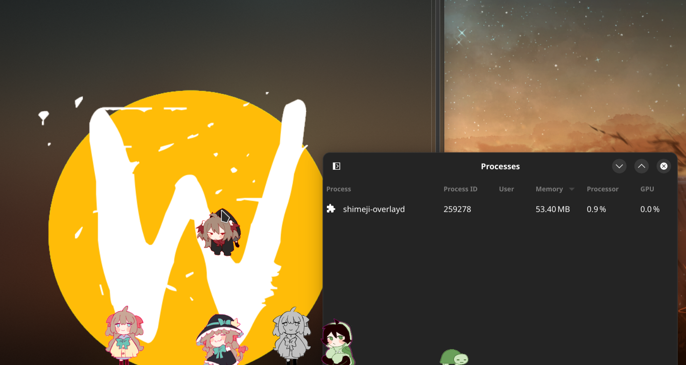

# wl_shimeji - Shimeji reimplementation for the Wayland

This is a reimplementation of the [Shimeji](https://kilkakon.com/shimeji/) for Wayland in C.

<p align="center">
  
</p>

Shimejis on the screenshot by [paccha](https://linktr.ee/paccha_) and [Moneka](https://x.com/Monikaphobia)

# Requirements

## Build requirements
- libspng
  - Arch: `pacman -S libspng`
  - Debian: `apt install libspng libspng-dev`
- libwayland-client:
  - Arch: `pacman -S wayland`
  - Debian: `apt install libwayland-client0 libwayland-client-dev`
- wayland-protocols:
  - Arch: `pacman -S wayland-protocols`
  - Debian: `apt install wayland-protocols`
- wlr-protocols:
  - Arch: `pacman -S wlr-protocols`
  - Debian: `apt install wlr-protocols`

## Runtime requirements
Your compositor should *at least* support xdg-shell, wlr-layer-shell protocols, and provide wl_subcompositor interface.

# Building

```sh
git clone https://github.com/CluelessCatBurger/wl_shimeji.git
cd wl_shimeji
make -j$(nproc)
make install
```

# Running

## Run daemon directly

Look `shimeji-overlayd --help` for more information

## Using shimejictl

`shimejictl` is a simple script that allows you to control shimeji overlay daemon, convert Shimeji-ee type mascots to the wl_shimeji format, and more.

### Convert Shimeji-ee mascots

  ```sh
  shimejictl convert /path/to/original/mascot/directory
  ```
It will write converted mascots to the ${config}/shimejis (usually config == ~/.local/share/wl_shimeji) or in the directory that you specified with `--output` option.

### Summoning and dismissing

  ```sh
    shimejictl summon <mascot_name>
  ```
  Launches the overlay if it’s not running and summons the mascot with the name <mascot_name> to the selected location

  ```sh
    shimejictl dismiss
  ```
  Selects mascot to dismiss and dismisses it.

  ```sh
    shimejictl summon all
  ```
  Summons all currently known mascots.

# Features

1. Less CPU
    - Because of C and Wayland, I was able to make this program as lightweight as possible.
    - When compared to the original Shimeji, my implementation for same configuration uses in ~20 times less CPU.
    (Tested on AMD Ryzen 9 5900HX, 7 mascots. Original Shimeji used ~19% of one CPU core. My implementation used ~0.9% of one CPU core)
    (Do not trust these numbers, they can be different for your configuration)
2. Less RAM
    - Because of prototypes-based method, mascots use as less memory as possible.
    (Tested on AMD Ryzen 9 5900HX, 7 mascots. Original Shimeji ~880MiB. My implementation used ~56MiB)
    (Do not trust these numbers, they can be different for your configuration)
3. Fast VM-based condition evaluation:
    - I implemented simple virtual machine and bytecode compiler for javascript-like conditions used in the original Shimeji.
    - It's not as fast as native code, but it's faster than the original Shimeji.

## TODO LIST:

- [x] Core functionality - Mascots are working
- [x] Affordances - Mascots can interact with each other
- [x] Hotspots on mascots - Mascots can be patted (My version uses middle click and scrolling for this instead of original left click)
- [x] Dragging - Mascots can be dragged around the screen
- [ ] Environment interaction - Mascots can interact with the environment (Foreign windows, pointer, etc)
- [ ] Plugins - Plugins for environment interaction
- [ ] Configuration - Configuration for things like cloning, draggability, etc

## Notes:

- About environment interaction: It will be available only through the plugins. Wayland protocol doesn't allow to interact with windows of other applications,
  and will NEVER allow it. It's a security feature. If you think that it makes Wayland bad, ask yourself a question: Why application even should have access to
  the windows of other applications? Try to find at least 5 apps that need this feature and then come back to me.
- About plugins: It will be .so files that will be loaded at runtime. It can implement any functionality to lookup positions of active window, pointer, etc.
  There is no way to make it portable. For example, you theoretically can use kdotool to get and move windows, but it's will work only under kwin.
- X11 support? No, X11 doesn't provide key features that I need for this project. You can try to implement it. For it to work, you need to implement each and every function from
  src/environment.h
- Windows/Macos/FreeBSD/InsertYourOS support? If you will able somehow run Wayland on it or reimplement funcs defined in src/environment.h, then yes. I don't have any plans to do it.
- If you want to help me with this project, beware src/mascot_config_parser.c. I warned you. (No, really, even i don't understand what's going on there.)

# Blabbering section:

## What is Shimeji?

Shimeji is a program that creates a little character that wanders around your desktop. It can be customized with different skins and can be set to interact with the desktop environment.

## Why did I start this project?

The original Shimeji is written in Java and very unoptimized. It uses a lot of CPU and memory.
For example, from cold start, in some configurations, setup from 7 mascots can eat up 880MiB of RAM and ~19% of one cpu core (AMD Ryzen 9 5900HX)

I think this is unacceptable for such a simple program.
Moreover, original Shimeji is starting lagging when too many mascots on the screen, and because each mascot is a SEPARATE WINDOW, it slow down entire
compositor, with probaility of crashing it.

Even if we close eyes on the graphics, the original Shimeji uses javascript for the conditions, so it's makes everything even slower.

## How my reimplementation is better?

When I started this project, i started with the idea of making it as fast and as lightweight as possible.
So i started to analyze the original Shimeji and found things that can be definitely improved.
For example, when original Shimeji creates a new mascot, it creates instance of the `Mascot` class. What's wrong with it?
Actually nothing, but if we check how instances of `Mascot` are created, we can see that each instance is holds it's own copy of configuration and all sprites.
This is a big problem, as configuration and sprites are not very small, so it's a waste of memory.

What we can do then to improve it? Answer is simple: Prototypes! Instead of copying configuration and sprites for each mascot, we can create a prototype of the mascot
and then reference it in the actual mascot, maintaining the same functionality, but with less memory usage.

So my entire reimplementation is based on this idea. I'm using prototypes for mascots, and only the necessary data is copied for each mascot.

But what about language and graphics? Why I choose C and Wayland from all the possible options?

### Wayland

This is quite interesting story. When I started this project, i was very interested in the Wayland protocol and how it works.
But this is not enough to choose it as a base for the project, so why Wayland? The answer is subcompositors.
In Wayland, everything that shown on the screen is a surface with it's role. For example, the window is a surface with a role of `xdg_toplevel`.
But what if we want to make complex window with multiple layers? Usually, we need to rerender everything in region that need to be updated.
It's can be difficult, it is developer's responsibility to handle it, and you should be smarter than me to do it.
But in Wayland, we have a concept of subcompositors. Subcompositor is a method to make composite window from multiple surfaces, and it's compositor's
responsibility to handle how window should be rendered. We will return to this later.

Then, if we return to prototypes, we can also find that wayland from box allows us create buffer only from shared memory, but at the same time, we
can reuse same buffer for multiple surfaces. This is exactly what we need for prototypes! We create our buffer only once, and then we reuse for each mascot when we need to.

Then we can start to implement our shimeji project, and...

Oh. oh no. We forgot about nature of Wayland.
Wayland is protocol with security in mind. It's not like X11, where you can do everything you want with the windows.
So what can we do? Or rather, what can’t we do? We can't position our mascots freely on the screen as we don't have access to the window positions (at all).

So, then what we actually can do?
If we open wayland.app, we can see set of protocols that exists in the Wayland. Not each protocol is implemented in each compositor,
but lets see what it can offer us.

So, wlroots created wlr-layer-shell protocol. This protocol allows us to create overlays on the screen. If we can create fullscreen overlay with no input and fully transparent,
we can guarantee that pixel on the overlay is the same as pixel on the screen, so now we can set position of our mascots freely.
But i don't want to render anything, what then I can do?

Now we can return to the subcompositors. We can use subcompositor functionality to avoid manual rendering of mascots. Instead we create subsurface for each mascot
and then attach it to our overlay. Now we can set position of our mascots freely and we don't need to render anything manually, because we use precreated buffers for each possible sprite.

### C

Now, when we decided to use Wayland, we need to choose language.
Oh, no language currently (Feb 2024) supports Wayland on same level as C (We need low level access to the Wayland protocol). Guess, I had no choice.
Anyway, it will economize memory and CPU usage, so it's not that bad.
That pretty much sums up why I choose C.

### Conditions and expressions in configuration files

Original Shimeji includes a feature called "Using JavaScript in places where you should not use JavaScript". I not expert in Shimeji-ee, but i think that
one of the reasons why 7 mascots can eat up 880MiB of RAM. I will not test it, but i decided that i will not include javascript in my project. Even if it means
that i will be required to implement compiler of javascript and my own virtual machine for it.
So now we have our own virtual machine instead of javascript. It was great experience.
